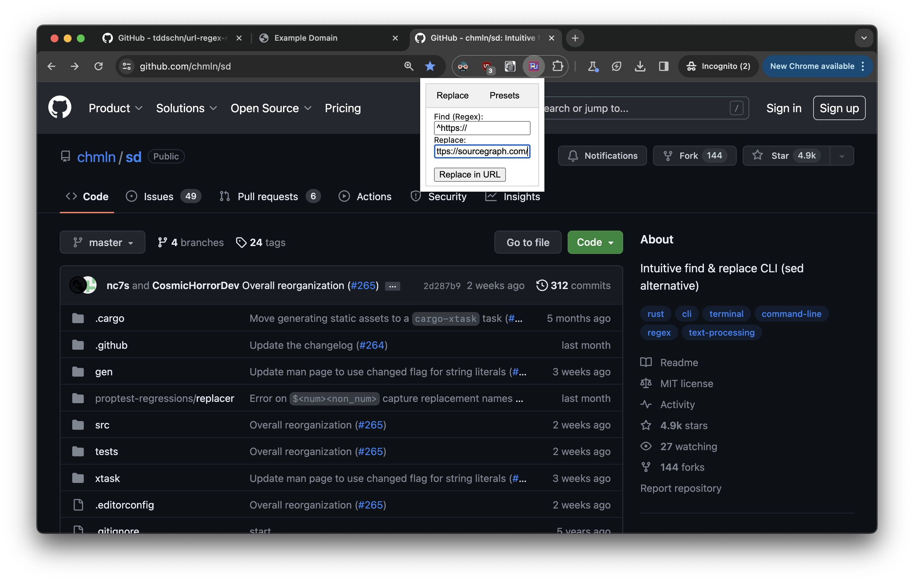
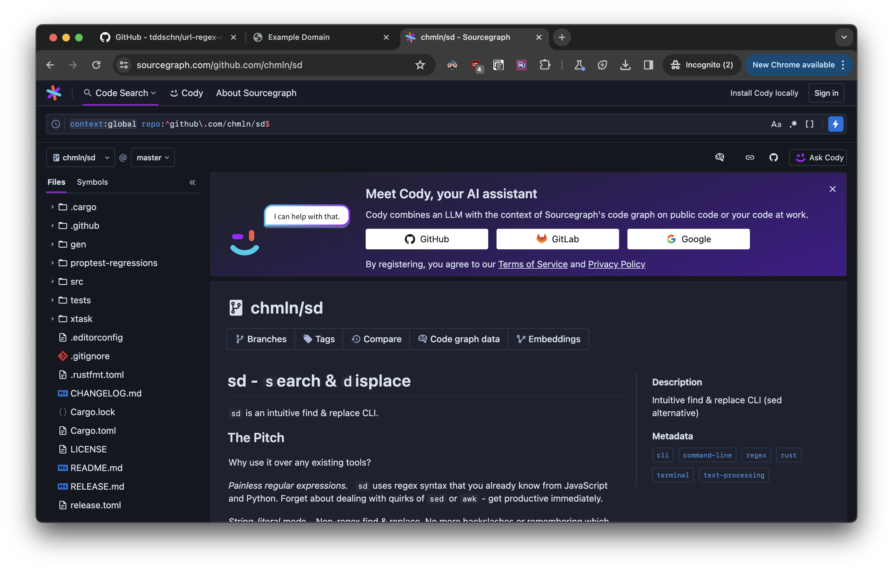
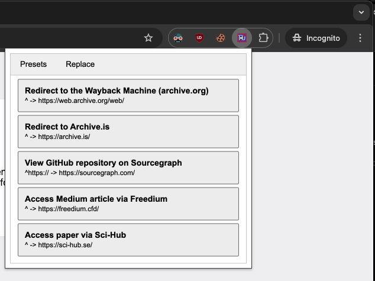
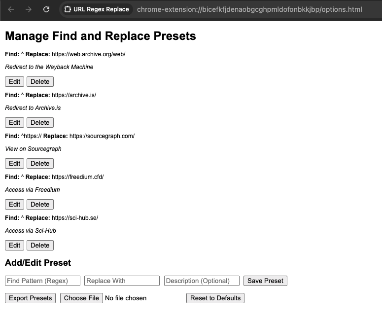

# URL Regex Replace Chrome Extension

The **URL Regex Replace** is a Chrome extension that allows users to perform regex find and replace on the current tab's URL. This extension is useful for modifying URLs, testing, or redirecting to different environments. It now includes an options page for managing frequently-used find and replace pairs and a revamped popup with two tabs for ease of use.

## Features

- Simple and lightweight.
- Ability to use regular expressions for URL modifications.
- Customizable find and replace fields.
- **New:** Manage a list of frequently-used find and replace pairs via the options page.
- **New:** Enhanced popup with two tabs: 'Replace' for manual entry and 'Presets' for quick application of saved pairs.

## Screenshots

Replacing `^https://` with `https://sourcegraph.com/` on a GitHub repository URL:

User-configurable find-and-replace pairs (presets):

Options page for managing presets:

## Installation

<!-- > [!NOTE] -->
<!-- > The store link below is outdated - will update when the review passes. -->

Install the **URL Regex Replace** extension from the [Chrome Web Store](https://chromewebstore.google.com/detail/url-regex-replace/nkohlbebkognioabnnjchnchdapolofb).

## Usage

> [!TIP]
> If you were using the previous version of this extension, also called `Prepend URL Chrome Extension`, the feature is still there! Just use the `^` character in the 'Find' field and the string you want to prepend in the 'Replace' field.

### Basic Usage
1. Click on the extension icon in the toolbar.
2. In the 'Replace' tab, enter the regex pattern in the 'Find' field and the replacement string in the 'Replace' field.
3. Click on the "Replace in URL" button to update the current tab's URL based on your regex pattern.

### Using Presets
1. Go to the 'Presets' tab in the popup.
2. Click on any of the saved find and replace pairs to apply them to the current tab's URL.

### Managing Presets
- **Access Options Page:** Right-click on the extension icon and select 'Options'.
- **Add New Pair:** Use the form at the top of the options page.
- **Edit, Delete, or Reorder Pairs:** Select one or more pairs and choose the appropriate action.

## Development

To contribute to the development of this extension, clone the repository and load it locally as an unpacked extension in Chrome.

## Building the Extension

Use the included `Makefile` for packaging:

- `make package` to create a zip file for distribution.
- `make list` to list the contents of the zip package.
- `make clean` to remove the zip file.

## Support

Open an issue [here](https://github.com/tddschn/url-regex-replace-chrome-extension/issues/new).

## Changelog

See [CHANGELOG.md](CHANGELOG.md).