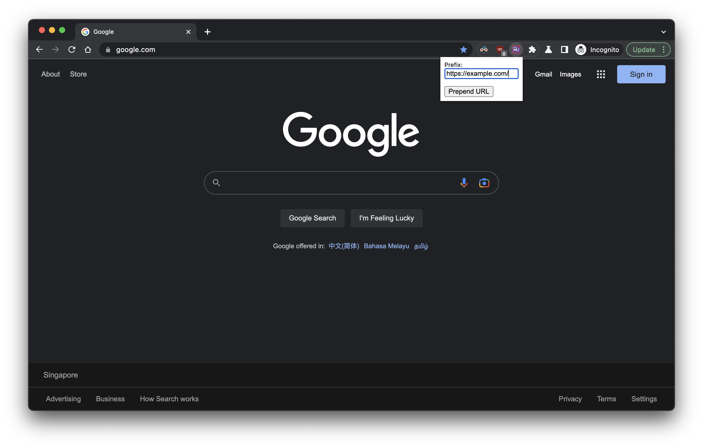
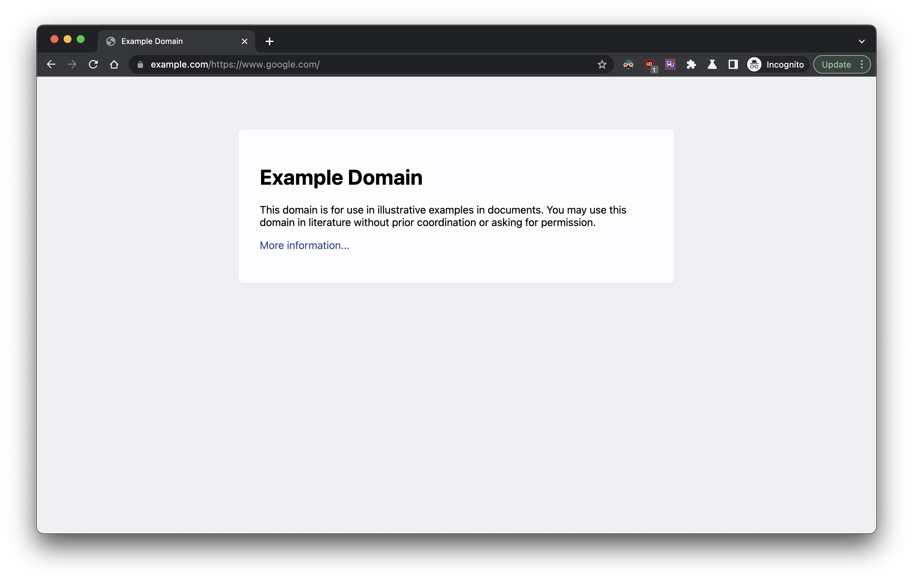

# Prepend URL Chrome Extension

The **Prepend URL** is a handy Chrome extension that allows users to add a pre-defined prefix to the current tab's URL and reload the page with the new URL. This is particularly useful for quick navigation to mirror sites, proxies, or any other use case where modifying the URL with a prefix is needed.

## Features

- Simple and lightweight.
- Easy to use with a single click.
- Customizable URL prefix.

## Installation

You can install the **Prepend URL** extension from the [Chrome Web Store](https://chrome.google.com/webstore/detail/prepend-url/nkohlbebkognioabnnjchnchdapolofb).

## Usage

1. Click on the extension icon in the toolbar.
2. Enter the prefix you want to prepend to the URL in the input field.
3. Click on the "Prepend URL" button to update the current tab's URL.

## Screenshots

## Development

If you're interested in contributing to the development of this extension, you can clone the repository and load it locally as an unpacked extension in Chrome.

## Building the Extension

A `Makefile` is included for packaging the extension. Use the following commands:

- `make package` to create a zip file for distribution.
- `make list` to list the contents of the zip package.
- `make clean` to remove the zip file.

## Support

Open an issue [here](./issues/new).

<!-- If you encounter any issues or have suggestions for improvements, please submit them to the [issue tracker](https://chrome.google.com/webstore/detail/prepend-url/nkohlbebkognioabnnjchnchdapolofb/support). -->

<!-- ## License -->
<!---->
<!-- This project is open-source and available under the [MIT License](LICENSE.md). -->
